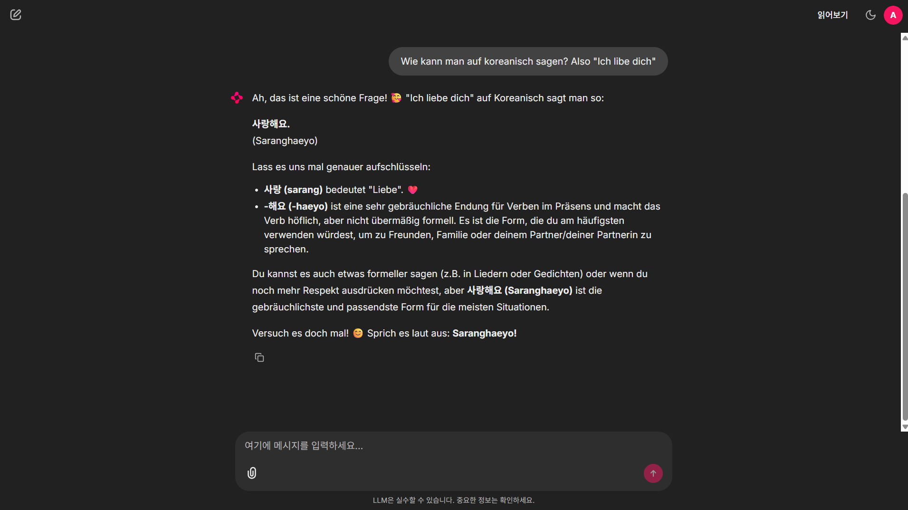

# 🇰🇷 Kim-Ssem: Der KI-Koreanisch-Tutor


Ein intelligenter, interaktiver Chatbot, der Deutschsprachigen hilft, Koreanisch zu lernen.

Entwickelt im Rahmen der Probeaufgabe für einen Praktikumsplatz bei **LME IT**.

---

## 🖼️ Vorschau (Preview)




---

## 💡 Die Idee & Motivation (Story)

Dieses Projekt verbindet mein technisches Interesse an **Google Gemini** mit einem persönlichen Anwendungsfall.

Meine Frau studiert Germanistik und arbeitet als Sprachlehrerin. Sie unterrichtet nicht nur Koreaner in Deutsch, sondern hat auch an der **Volkshochschule (VHS) Oberhausen** Deutschen Koreanisch beigebracht.

Dabei kam mir die Idee: **"Was, wenn ihre Schüler einen 'KI-Assistenzlehrer' hätten, mit dem sie jederzeit üben können?"**
So entstand **"Kim-Ssem"** – eine geduldige KI-Tutorin, die:

* 🇩🇪 **Auf Deutsch erklärt:** Grammatik und Vokabeln verständlich vermittelt.
* 🧠 **Kontext versteht:** Sich an den Gesprächsverlauf erinnert (dank Session Memory).
* ❤️ **Empathisch reagiert:** Den Nutzer motiviert und korrigiert, genau wie ein echter Lehrer.

## 🚀 Technische Highlights

Dieses Projekt demonstriert Full-Stack-Kompetenzen im Backend-Bereich:

1. **AI Integration (Gemini 2.5 Flash):**
    * Nutzung des neuesten Google-Modells für extrem schnelle und kosteneffiziente Antworten.
    * **Streaming Response:** Antwortet in Echtzeit (Typewriter-Effekt).
2. **Hybrides Authentifizierungssystem (Security):**
    * **Datenbank:** SQLite mit **SHA-256 Passwort-Hashing** für sicheren lokalen Login.
    * **OAuth 2.0:** Integration von **Google** und **GitHub** Login.
3. **Modernes Tooling:**
    * Das Projekt wird mit **`uv`** (Rust-basierter Python Package Manager) verwaltet – für blitzschnelle Installationen.

---

## 🛠️ Installation & Start

### Voraussetzungen

* Python 3.9 oder höher
* Ein Google API Key (kostenlos via Google AI Studio)
* (Optional) Google/GitHub Client IDs für OAuth

### Option A: Mit `uv` (Empfohlen ⚡)

Dieses Projekt ist für `uv` optimiert.

```bash
# 1. Repository klonen
git clone <REPO_URL>
cd lme_project

# 2. Abhängigkeiten installieren (erstellt automatisch venv)
uv sync

# 3. Datenbank initialisieren (erstellt user_data.db)
uv run python sqlite_user.py

# 4. App starten
uv run chainlit run app.py -w
```

### Option B: Mit Standard `pip`

Falls `uv` nicht installiert ist:

```bash
# 1. Virtuelle Umgebung erstellen & aktivieren
python -m venv .venv
source .venv/bin/activate  # Windows: .venv\Scripts\activate

# 2. Abhängigkeiten installieren
pip install -r requirements.txt

# 3. Datenbank & Start
python sqlite_user.py
chainlit run app.py -w
```

---

## 🔑 Konfiguration (.env)

Kopieren Sie die `env.example` zu `.env` und fügen Sie Ihre Schlüssel hinzu:

```env
# --- PFLICHTFELDER (REQUIRED) ---
GOOGLE_API_KEY=AIzaSy... (Ihr Key)
CHAINLIT_AUTH_SECRET=LME_TEST_SECRET_1234

# --- OPTIONAL (FÜR OAUTH) ---
# Wenn diese fehlen, funktionieren die Social-Login-Buttons nicht.
OAUTH_GOOGLE_CLIENT_ID=...
OAUTH_GOOGLE_CLIENT_SECRET=...
OAUTH_GITHUB_CLIENT_ID=...
OAUTH_GITHUB_CLIENT_SECRET=...
```

---

## 👤 Login-Daten (Demo)

Für den lokalen Test (SQLite) sind folgende Benutzer vorkonfiguriert:

| Benutzername | Passwort | Rolle |
| :--- | :--- | :--- |
| **admin** | `1234` | Admin |

*(Natürlich können Sie sich auch einfach via Google/GitHub einloggen!)*
